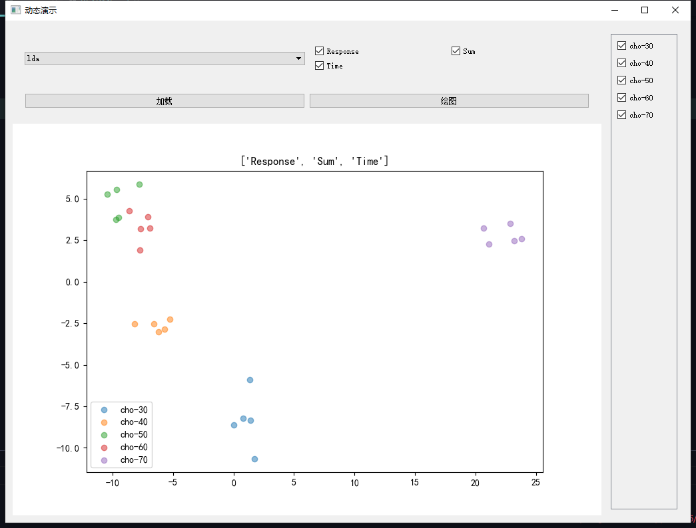

## 软件说明
码云仓库：https://gitee.com/glider123/elecnose_feature

程序可选pca和lda两种降维方式显示

特征可选灵敏度（response），积分面积（sum），响应恢复时间（time）

右侧可选当前数据文件夹内的物质种类

数据文件为txt类型，结构参考本项目中的示例（data目录下）

data目录内为示例样本，仅用于测试本程序，请勿用于其他用途

## 软件环境配置
### python
python3
[下载地址](https://www.python.org/)  
**注意安装时勾选上path**  

### python的各种依赖包 

现成算法只用到了sklearn、matplotlib、pandas、scipy、pyqt5

接下来是操作流程 按下win+r，输入cmd打开命令行窗口
复制粘贴以下内容,回车

`pip install matplotlib==3.3.4 scikit-learn==0.24.2 scipy==1.6.2 pyqt5 -i https://pypi.tuna.tsinghua.edu.cn/simple`

## 更新计划
- [ ] 通道个数选择功能
- [ ] 加载中gif显示
- [ ] 信号处理可视化